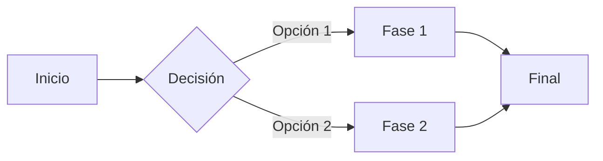

# htcpcp-server

HTCPCP Protocol implementation based on RFC 2324

## Opentelemetry install

```bash
poetry add opentelemetry-api
poetry add opentelemetry-sdk
poetry add opentelemetry-instrumentation
poetry add opentelemetry-exporter-otlp
poetry add opentelemetry-instrumentation-fastapi
```

## Mermaid example

```mermaid
graph TD
    A[fastapi 0.105.0 FastAPI framework, high performance, easy to learn, fast to code, ready for production] --> B[anyio >=3.7.1,<4.0.0 ]
    B[anyio >=3.7.1,<4.0.0 ] --> C[idna >=2.8 ]
    B[anyio >=3.7.1,<4.0.0 ] --> D[sniffio >=1.1 ]
    A[fastapi 0.105.0 FastAPI framework, high performance, easy to learn, fast to code, ready for production] --> E[pydantic >=1.7.4,<1.8 or >1.8,<1.8.1 or >1.8.1,<2.0.0 or >2.0.0,<2.0.1 or >2.0.1,<2.1.0 or >2.1.0,<3.0.0]
    E[pydantic >=1.7.4,<1.8 or >1.8,<1.8.1 or >1.8.1,<2.0.0 or >2.0.0,<2.0.1 or >2.0.1,<2.1.0 or >2.1.0,<3.0.0] --> F[annotated-types >=0.6.0 ]
    E[pydantic >=1.7.4,<1.8 or >1.8,<1.8.1 or >1.8.1,<2.0.0 or >2.0.0,<2.0.1 or >2.0.1,<2.1.0 or >2.1.0,<3.0.0] --> G[pydantic-core 2.23.4 ]
    G[pydantic-core 2.23.4 ] --> H[typing-extensions >=4.6.0,<4.7.0 or >4.7.0 ]
    E[pydantic >=1.7.4,<1.8 or >1.8,<1.8.1 or >1.8.1,<2.0.0 or >2.0.0,<2.0.1 or >2.0.1,<2.1.0 or >2.1.0,<3.0.0] --> I[typing-extensions >=4.12.2 circular dependency aborted here]
    E[pydantic >=1.7.4,<1.8 or >1.8,<1.8.1 or >1.8.1,<2.0.0 or >2.0.0,<2.0.1 or >2.0.1,<2.1.0 or >2.1.0,<3.0.0] --> J[typing-extensions >=4.6.1 circular dependency aborted here]
    A[fastapi 0.105.0 FastAPI framework, high performance, easy to learn, fast to code, ready for production] --> K[starlette >=0.27.0,<0.28.0 ]
    K[starlette >=0.27.0,<0.28.0 ] --> L[anyio >=3.4.0,<5 ]
    L[anyio >=3.4.0,<5 ] --> C[idna >=2.8 ]
    L[anyio >=3.4.0,<5 ] --> D[sniffio >=1.1 ]
    A[fastapi 0.105.0 FastAPI framework, high performance, easy to learn, fast to code, ready for production] --> M[typing-extensions >=4.8.0 ]
    O[httpx 0.27.2 The next generation HTTP client.] --> P[anyio * ]
    P[anyio * ] --> C[idna >=2.8 ]
    P[anyio * ] --> D[sniffio >=1.1 ]
    O[httpx 0.27.2 The next generation HTTP client.] --> Q[certifi * ]
    O[httpx 0.27.2 The next generation HTTP client.] --> R[httpcore ==1.* ]
    R[httpcore ==1.* ] --> Q[certifi * ]
    R[httpcore ==1.* ] --> S[h11 >=0.13,<0.15 ]
    O[httpx 0.27.2 The next generation HTTP client.] --> T[idna * ]
    O[httpx 0.27.2 The next generation HTTP client.] --> U[sniffio * ]
    V[loguru 0.7.2 Python logging made stupidly simple] --> W[colorama >=0.3.4 ]
    V[loguru 0.7.2 Python logging made stupidly simple] --> X[win32-setctime >=1.0.0 ]
    Y[mangum 0.19.0 AWS Lambda support for ASGI applications] --> Z[typing-extensions * ]
    B1[opentelemetry-api 1.27.0 OpenTelemetry Python API] --> C1[deprecated >=1.2.6 ]
    C1[deprecated >=1.2.6 ] --> D1[wrapt >=1.10,<2 ]
    B1[opentelemetry-api 1.27.0 OpenTelemetry Python API] --> E1[importlib-metadata >=6.0,<=8.4.0 ]
    E1[importlib-metadata >=6.0,<=8.4.0 ] --> F1[zipp >=0.5 ]
    G1[opentelemetry-exporter-otlp 1.27.0 OpenTelemetry Collector Exporters] --> H1[opentelemetry-exporter-otlp-proto-grpc 1.27.0 ]
    H1[opentelemetry-exporter-otlp-proto-grpc 1.27.0 ] --> C1[deprecated >=1.2.6 ]
    C1[deprecated >=1.2.6 ] --> D1[wrapt >=1.10,<2 ]
    H1[opentelemetry-exporter-otlp-proto-grpc 1.27.0 ] --> I1[googleapis-common-protos >=1.52,<2.0 ]
    I1[googleapis-common-protos >=1.52,<2.0 ] --> J1[protobuf >=3.20.2,<4.21.1 or >4.21.1,<4.21.2 or >4.21.2,<4.21.3 or >4.21.3,<4.21.4 or >4.21.4,<4.21.5 or >4.21.5,<6.0.0.dev0 ]
    H1[opentelemetry-exporter-otlp-proto-grpc 1.27.0 ] --> K1[grpcio >=1.0.0,<2.0.0 ]
    H1[opentelemetry-exporter-otlp-proto-grpc 1.27.0 ] --> L1[opentelemetry-api >=1.15,<2.0 ]
    L1[opentelemetry-api >=1.15,<2.0 ] --> C1[deprecated >=1.2.6 ]
    L1[opentelemetry-api >=1.15,<2.0 ] --> E1[importlib-metadata >=6.0,<=8.4.0 ]
    E1[importlib-metadata >=6.0,<=8.4.0 ] --> F1[zipp >=0.5 ]
    H1[opentelemetry-exporter-otlp-proto-grpc 1.27.0 ] --> M1[opentelemetry-exporter-otlp-proto-common 1.27.0 ]
    M1[opentelemetry-exporter-otlp-proto-common 1.27.0 ] --> N1[opentelemetry-proto 1.27.0 ]
    N1[opentelemetry-proto 1.27.0 ] --> O1[protobuf >=3.19,<5.0 circular dependency aborted here]
    H1[opentelemetry-exporter-otlp-proto-grpc 1.27.0 ] --> N1[opentelemetry-proto 1.27.0 ]
    H1[opentelemetry-exporter-otlp-proto-grpc 1.27.0 ] --> P1[opentelemetry-sdk >=1.27.0,<1.28.0 ]
    P1[opentelemetry-sdk >=1.27.0,<1.28.0 ] --> B1[opentelemetry-api 1.27.0 OpenTelemetry Python API]
    P1[opentelemetry-sdk >=1.27.0,<1.28.0 ] --> Q1[opentelemetry-semantic-conventions 0.48b0 ]
    Q1[opentelemetry-semantic-conventions 0.48b0 ] --> C1[deprecated >=1.2.6 ]
    Q1[opentelemetry-semantic-conventions 0.48b0 ] --> B1[opentelemetry-api 1.27.0 OpenTelemetry Python API]
    P1[opentelemetry-sdk >=1.27.0,<1.28.0 ] --> R1[typing-extensions >=3.7.4 ]
    G1[opentelemetry-exporter-otlp 1.27.0 OpenTelemetry Collector Exporters] --> S1[opentelemetry-exporter-otlp-proto-http 1.27.0 ]
    S1[opentelemetry-exporter-otlp-proto-http 1.27.0 ] --> C1[deprecated >=1.2.6 ]
    C1[deprecated >=1.2.6 ] --> D1[wrapt >=1.10,<2 ]
    S1[opentelemetry-exporter-otlp-proto-http 1.27.0 ] --> I1[googleapis-common-protos >=1.52,<2.0 ]
    I1[googleapis-common-protos >=1.52,<2.0 ] --> J1[protobuf >=3.20.2,<4.21.1 or >4.21.1,<4.21.2 or >4.21.2,<4.21.3 or >4.21.3,<4.21.4 or >4.21.4,<4.21.5 or >4.21.5,<6.0.0.dev0 ]
    S1[opentelemetry-exporter-otlp-proto-http 1.27.0 ] --> L1[opentelemetry-api >=1.15,<2.0 ]
    L1[opentelemetry-api >=1.15,<2.0 ] --> C1[deprecated >=1.2.6 ]
    L1[opentelemetry-api >=1.15,<2.0 ] --> E1[importlib-metadata >=6.0,<=8.4.0 ]
    E1[importlib-metadata >=6.0,<=8.4.0 ] --> F1[zipp >=0.5 ]
    S1[opentelemetry-exporter-otlp-proto-http 1.27.0 ] --> M1[opentelemetry-exporter-otlp-proto-common 1.27.0 ]
    M1[opentelemetry-exporter-otlp-proto-common 1.27.0 ] --> N1[opentelemetry-proto 1.27.0 ]
    N1[opentelemetry-proto 1.27.0 ] --> O1[protobuf >=3.19,<5.0 circular dependency aborted here]
    S1[opentelemetry-exporter-otlp-proto-http 1.27.0 ] --> N1[opentelemetry-proto 1.27.0 ]
    S1[opentelemetry-exporter-otlp-proto-http 1.27.0 ] --> P1[opentelemetry-sdk >=1.27.0,<1.28.0 ]
    P1[opentelemetry-sdk >=1.27.0,<1.28.0 ] --> B1[opentelemetry-api 1.27.0 OpenTelemetry Python API]
    P1[opentelemetry-sdk >=1.27.0,<1.28.0 ] --> Q1[opentelemetry-semantic-conventions 0.48b0 ]
    Q1[opentelemetry-semantic-conventions 0.48b0 ] --> C1[deprecated >=1.2.6 ]
    Q1[opentelemetry-semantic-conventions 0.48b0 ] --> B1[opentelemetry-api 1.27.0 OpenTelemetry Python API]
    P1[opentelemetry-sdk >=1.27.0,<1.28.0 ] --> R1[typing-extensions >=3.7.4 ]
    S1[opentelemetry-exporter-otlp-proto-http 1.27.0 ] --> T1[requests >=2.7,<3.0 ]
    T1[requests >=2.7,<3.0 ] --> U1[certifi >=2017.4.17 ]
    T1[requests >=2.7,<3.0 ] --> V1[charset-normalizer >=2,<4 ]
    T1[requests >=2.7,<3.0 ] --> W1[idna >=2.5,<4 ]
    T1[requests >=2.7,<3.0 ] --> X1[urllib3 >=1.21.1,<3 ]
    Y1[opentelemetry-instrumentation 0.48b0 Instrumentation Tools & Auto Instrumentation for OpenTelemetry Python] --> Z1[opentelemetry-api >=1.4,<2.0 ]
    Z1[opentelemetry-api >=1.4,<2.0 ] --> C1[deprecated >=1.2.6 ]
    C1[deprecated >=1.2.6 ] --> D1[wrapt >=1.10,<2 ]
    Z1[opentelemetry-api >=1.4,<2.0 ] --> E1[importlib-metadata >=6.0,<=8.4.0 ]
    E1[importlib-metadata >=6.0,<=8.4.0 ] --> F1[zipp >=0.5 ]
    Y1[opentelemetry-instrumentation 0.48b0 Instrumentation Tools & Auto Instrumentation for OpenTelemetry Python] --> A2[setuptools >=16.0 ]
    Y1[opentelemetry-instrumentation 0.48b0 Instrumentation Tools & Auto Instrumentation for OpenTelemetry Python] --> B2[wrapt >=1.0.0,<2.0.0 ]
    C2[opentelemetry-instrumentation-fastapi 0.48b0 OpenTelemetry FastAPI Instrumentation] --> D2[opentelemetry-api >=1.12,<2.0 ]
    D2[opentelemetry-api >=1.12,<2.0 ] --> C1[deprecated >=1.2.6 ]
    C1[deprecated >=1.2.6 ] --> D1[wrapt >=1.10,<2 ]
    D2[opentelemetry-api >=1.12,<2.0 ] --> E1[importlib-metadata >=6.0,<=8.4.0 ]
    E1[importlib-metadata >=6.0,<=8.4.0 ] --> F1[zipp >=0.5 ]
    C2[opentelemetry-instrumentation-fastapi 0.48b0 OpenTelemetry FastAPI Instrumentation] --> Y1[opentelemetry-instrumentation 0.48b0 Instrumentation Tools & Auto Instrumentation for OpenTelemetry Python]
    Y1[opentelemetry-instrumentation 0.48b0 Instrumentation Tools & Auto Instrumentation for OpenTelemetry Python] --> Z1[opentelemetry-api >=1.4,<2.0 ]
    Z1[opentelemetry-api >=1.4,<2.0 ] --> C1[deprecated >=1.2.6 ]
    C1[deprecated >=1.2.6 ] --> D1[wrapt >=1.10,<2 ]
    Z1[opentelemetry-api >=1.4,<2.0 ] --> E1[importlib-metadata >=6.0,<=8.4.0 ]
    E1[importlib-metadata >=6.0,<=8.4.0 ] --> F1[zipp >=0.5 ]
    Y1[opentelemetry-instrumentation 0.48b0 Instrumentation Tools & Auto Instrumentation for OpenTelemetry Python] --> A2[setuptools >=16.0 ]
    Y1[opentelemetry-instrumentation 0.48b0 Instrumentation Tools & Auto Instrumentation for OpenTelemetry Python] --> B2[wrapt >=1.0.0,<2.0.0 ]
    C2[opentelemetry-instrumentation-fastapi 0.48b0 OpenTelemetry FastAPI Instrumentation] --> E2[opentelemetry-instrumentation-asgi 0.48b0 ]
    E2[opentelemetry-instrumentation-asgi 0.48b0 ] --> F2[asgiref >=3.0,<4.0 ]
    E2[opentelemetry-instrumentation-asgi 0.48b0 ] --> D2[opentelemetry-api >=1.12,<2.0 ]
    D2[opentelemetry-api >=1.12,<2.0 ] --> C1[deprecated >=1.2.6 ]
    C1[deprecated >=1.2.6 ] --> D1[wrapt >=1.10,<2 ]
    D2[opentelemetry-api >=1.12,<2.0 ] --> E1[importlib-metadata >=6.0,<=8.4.0 ]
    E1[importlib-metadata >=6.0,<=8.4.0 ] --> F1[zipp >=0.5 ]
    E2[opentelemetry-instrumentation-asgi 0.48b0 ] --> Y1[opentelemetry-instrumentation 0.48b0 Instrumentation Tools & Auto Instrumentation for OpenTelemetry Python]       
    Y1[opentelemetry-instrumentation 0.48b0 Instrumentation Tools & Auto Instrumentation for OpenTelemetry Python] --> Z1[opentelemetry-api >=1.4,<2.0 ]
    Y1[opentelemetry-instrumentation 0.48b0 Instrumentation Tools & Auto Instrumentation for OpenTelemetry Python] --> A2[setuptools >=16.0 ]
    Y1[opentelemetry-instrumentation 0.48b0 Instrumentation Tools & Auto Instrumentation for OpenTelemetry Python] --> B2[wrapt >=1.0.0,<2.0.0 ]
    E2[opentelemetry-instrumentation-asgi 0.48b0 ] --> Q1[opentelemetry-semantic-conventions 0.48b0 ]
    Q1[opentelemetry-semantic-conventions 0.48b0 ] --> C1[deprecated >=1.2.6 ]
    Q1[opentelemetry-semantic-conventions 0.48b0 ] --> B1[opentelemetry-api 1.27.0 OpenTelemetry Python API]
    E2[opentelemetry-instrumentation-asgi 0.48b0 ] --> G2[opentelemetry-util-http 0.48b0 ]
    C2[opentelemetry-instrumentation-fastapi 0.48b0 OpenTelemetry FastAPI Instrumentation] --> Q1[opentelemetry-semantic-conventions 0.48b0 ]
    Q1[opentelemetry-semantic-conventions 0.48b0 ] --> C1[deprecated >=1.2.6 ]
    C1[deprecated >=1.2.6 ] --> D1[wrapt >=1.10,<2 ]
    Q1[opentelemetry-semantic-conventions 0.48b0 ] --> B1[opentelemetry-api 1.27.0 OpenTelemetry Python API]
    B1[opentelemetry-api 1.27.0 OpenTelemetry Python API] --> C1[deprecated >=1.2.6 ]
    B1[opentelemetry-api 1.27.0 OpenTelemetry Python API] --> E1[importlib-metadata >=6.0,<=8.4.0 ]
    E1[importlib-metadata >=6.0,<=8.4.0 ] --> F1[zipp >=0.5 ]
    C2[opentelemetry-instrumentation-fastapi 0.48b0 OpenTelemetry FastAPI Instrumentation] --> G2[opentelemetry-util-http 0.48b0 ]
    H2[opentelemetry-sdk 1.27.0 OpenTelemetry Python SDK] --> B1[opentelemetry-api 1.27.0 OpenTelemetry Python API]
    B1[opentelemetry-api 1.27.0 OpenTelemetry Python API] --> C1[deprecated >=1.2.6 ]
    C1[deprecated >=1.2.6 ] --> D1[wrapt >=1.10,<2 ]
    B1[opentelemetry-api 1.27.0 OpenTelemetry Python API] --> E1[importlib-metadata >=6.0,<=8.4.0 ]
    E1[importlib-metadata >=6.0,<=8.4.0 ] --> F1[zipp >=0.5 ]
    H2[opentelemetry-sdk 1.27.0 OpenTelemetry Python SDK] --> Q1[opentelemetry-semantic-conventions 0.48b0 ]
    Q1[opentelemetry-semantic-conventions 0.48b0 ] --> C1[deprecated >=1.2.6 ]
    C1[deprecated >=1.2.6 ] --> D1[wrapt >=1.10,<2 ]
    Q1[opentelemetry-semantic-conventions 0.48b0 ] --> B1[opentelemetry-api 1.27.0 OpenTelemetry Python API]
    B1[opentelemetry-api 1.27.0 OpenTelemetry Python API] --> C1[deprecated >=1.2.6 ]
    B1[opentelemetry-api 1.27.0 OpenTelemetry Python API] --> E1[importlib-metadata >=6.0,<=8.4.0 ]
    E1[importlib-metadata >=6.0,<=8.4.0 ] --> F1[zipp >=0.5 ]
    H2[opentelemetry-sdk 1.27.0 OpenTelemetry Python SDK] --> R1[typing-extensions >=3.7.4 ]
    I2[pydantic 2.9.2 Data validation using Python type hints] --> F[annotated-types >=0.6.0 ]
    I2[pydantic 2.9.2 Data validation using Python type hints] --> G[pydantic-core 2.23.4 ]
    G[pydantic-core 2.23.4 ] --> H[typing-extensions >=4.6.0,<4.7.0 or >4.7.0 ]
    I2[pydantic 2.9.2 Data validation using Python type hints] --> I[typing-extensions >=4.12.2 circular dependency aborted here]
    I2[pydantic 2.9.2 Data validation using Python type hints] --> J[typing-extensions >=4.6.1 circular dependency aborted here]
    J2[pytest 7.4.4 pytest: simple powerful testing with Python] --> K2[colorama * ]
    J2[pytest 7.4.4 pytest: simple powerful testing with Python] --> L2[iniconfig * ]
    J2[pytest 7.4.4 pytest: simple powerful testing with Python] --> M2[packaging * ]
    J2[pytest 7.4.4 pytest: simple powerful testing with Python] --> N2[pluggy >=0.12,<2.0 ]
    O2[pytest-asyncio 0.23.8 Pytest support for asyncio] --> P2[pytest >=7.0.0,<9 ]
    P2[pytest >=7.0.0,<9 ] --> K2[colorama * ]
    P2[pytest >=7.0.0,<9 ] --> L2[iniconfig * ]
    P2[pytest >=7.0.0,<9 ] --> M2[packaging * ]
    P2[pytest >=7.0.0,<9 ] --> N2[pluggy >=0.12,<2.0 ]
    Q2[pytest-cov 4.1.0 Pytest plugin for measuring coverage.] --> R2[coverage >=5.2.1 ]
    Q2[pytest-cov 4.1.0 Pytest plugin for measuring coverage.] --> S2[pytest >=4.6 ]
    S2[pytest >=4.6 ] --> K2[colorama * ]
    S2[pytest >=4.6 ] --> L2[iniconfig * ]
    S2[pytest >=4.6 ] --> M2[packaging * ]
    S2[pytest >=4.6 ] --> N2[pluggy >=0.12,<2.0 ]
    T2[pytest-mock 3.14.0 Thin-wrapper around the mock package for easier use with pytest] --> U2[pytest >=6.2.5 ]
    U2[pytest >=6.2.5 ] --> K2[colorama * ]
    U2[pytest >=6.2.5 ] --> L2[iniconfig * ]
    U2[pytest >=6.2.5 ] --> M2[packaging * ]
    U2[pytest >=6.2.5 ] --> N2[pluggy >=0.12,<2.0 ]
    V2[svix-ksuid 0.6.2 A pure-Python KSUID implementation] --> W2[python-baseconv * ]
    X2[uvicorn 0.32.0 The lightning-fast ASGI server.] --> Y2[click >=7.0 ]
    Y2[click >=7.0 ] --> K2[colorama * ]
    X2[uvicorn 0.32.0 The lightning-fast ASGI server.] --> Z2[h11 >=0.8 ]
```







